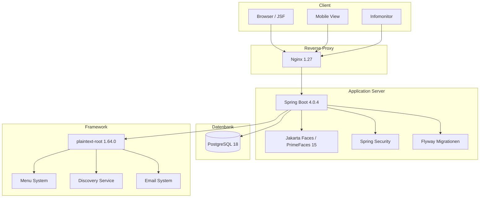
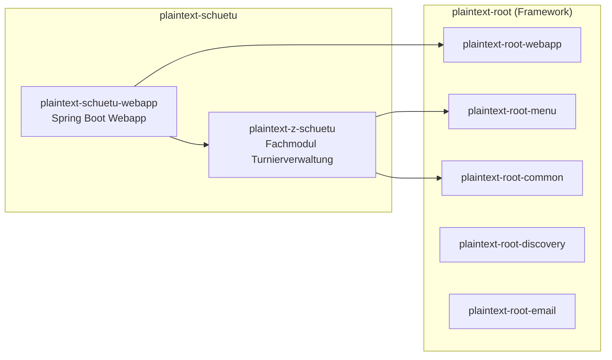
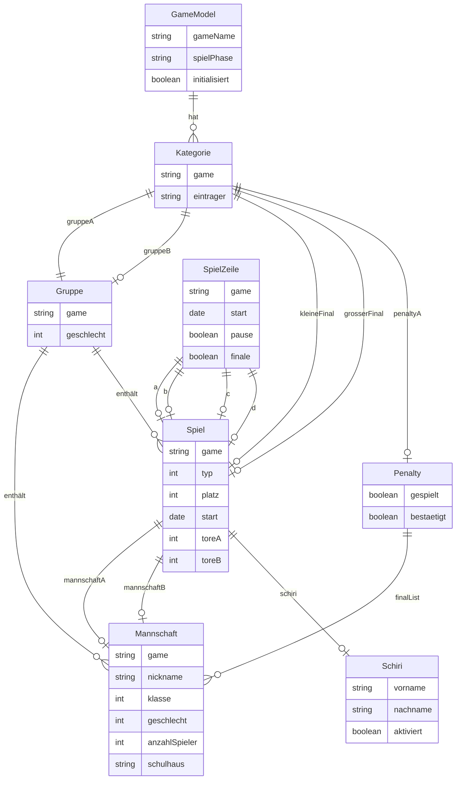
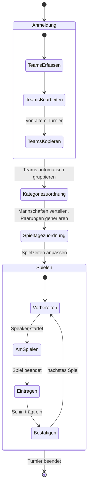
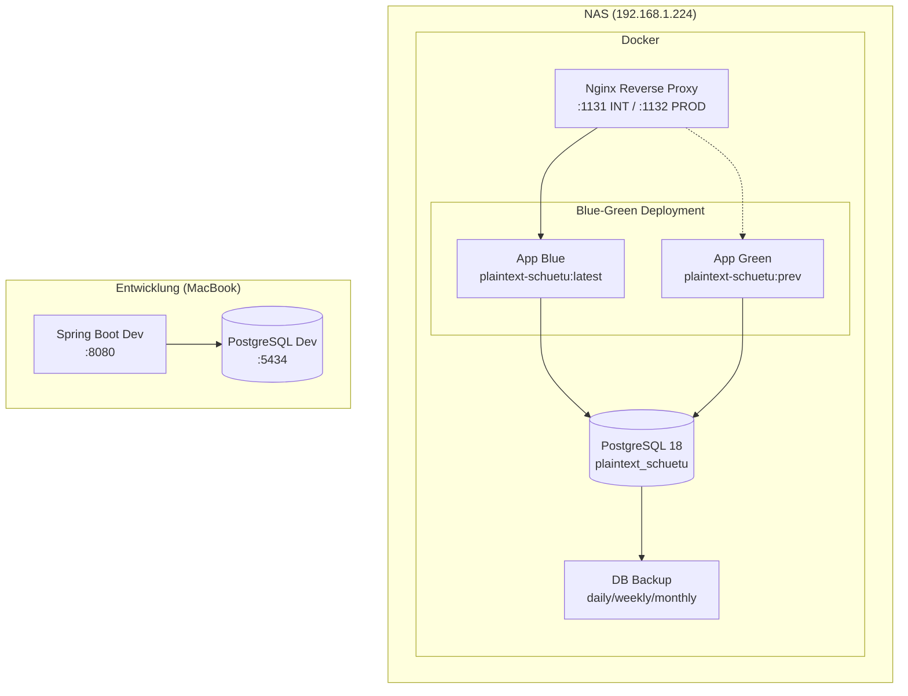

# Architektur - Plaintext Schülerturnier

## Systemübersicht

Das Plaintext Schülerturnier ist eine webbasierte Turnierverwaltung für Schülerfussballturniere. Die Anwendung verwaltet den gesamten Lebenszyklus eines Turniers - von der Anmeldung der Mannschaften über die Spielplanung bis zur Durchführung und Ranglistenberechnung.

## Modulstruktur

## Domänenmodell

## Turnierphasen

## Deployment-Architektur

## Technologie-Stack

| Komponente | Technologie | Version |
|-----------|------------|---------|
| Runtime | Java | 25 |
| Framework | Spring Boot | 4.0.4 |
| Frontend | PrimeFaces (JSF) | 15.0.13 |
| JSF Integration | JoinFaces | 6.0.4 |
| ORM | Hibernate | 7.x |
| Datenbank | PostgreSQL | 18.3 |
| Migration | Flyway | auto |
| Security | Spring Security | 7.0.4 |
| Build | Maven | 3.x |
| Container | Podman/Docker | latest |
| Reverse Proxy | Nginx | 1.27 |
| CI/CD | GitHub Actions | v2 |

## Wichtige Entwurfsentscheidungen

1. **LAZY Fetching** - Alle JPA-Beziehungen verwenden LAZY Loading, um das PostgreSQL-1664-Spalten-Limit nicht zu überschreiten
2. **Open-Session-In-View** - Aktiviert (`spring.jpa.open-in-view: true`), damit LAZY Loading in JSF-Views funktioniert
3. **Session-Scoped Beans** - GameSelectionHolder, Backing Beans etc. sind session-scoped für Turnier-Kontext
4. **Blue-Green Deployment** - Zero-Downtime-Deployments via Nginx Upstream-Switching
5. **HSQLDB-Import** - REST-Endpoint `/nosec/api/import/hsqldb` für Datenmigration von der alten App
